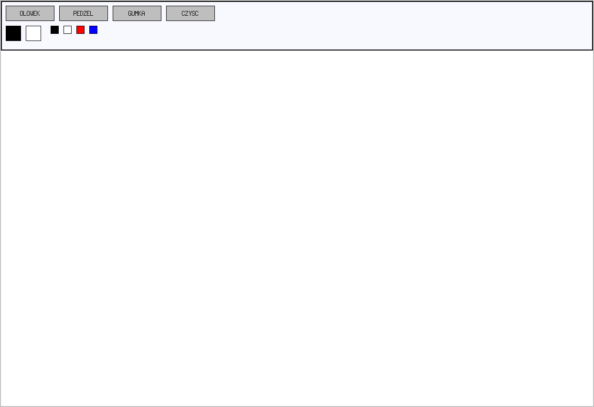
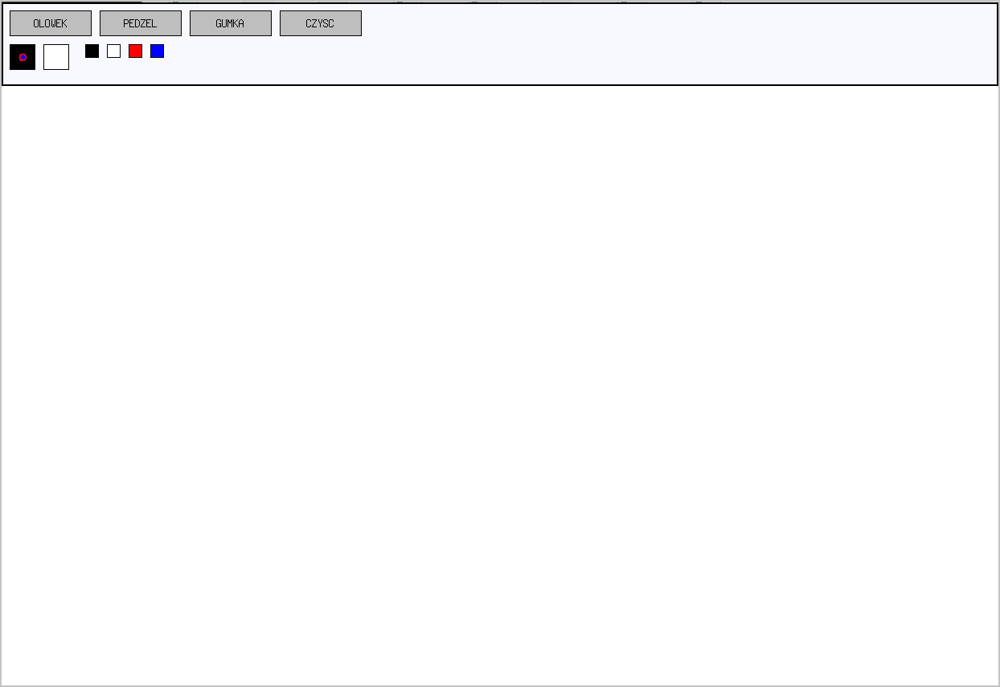
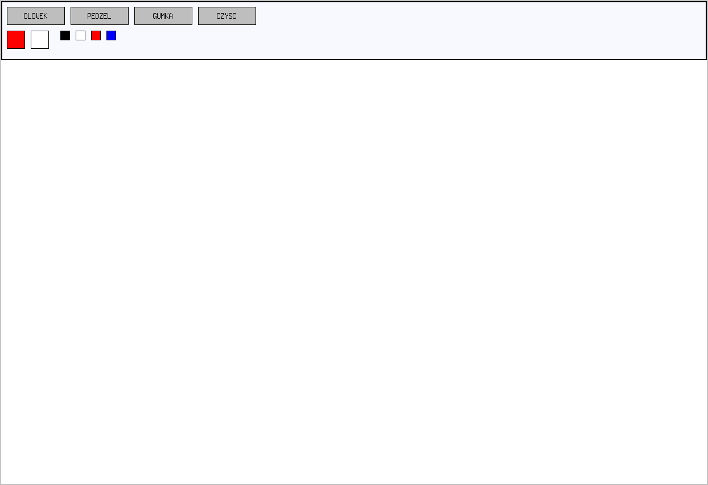
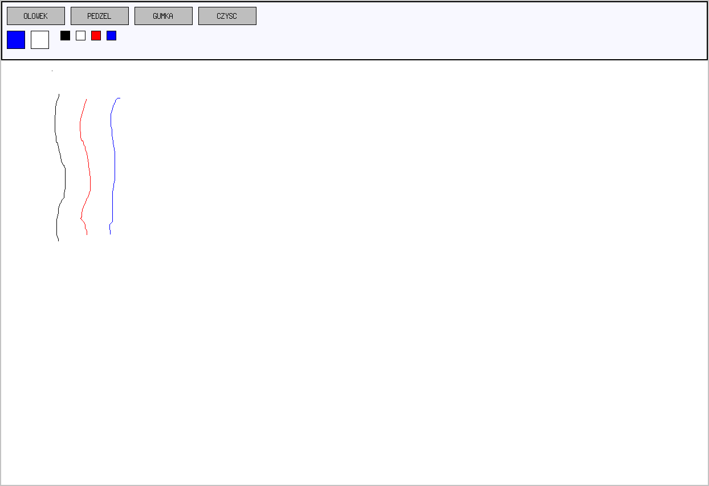
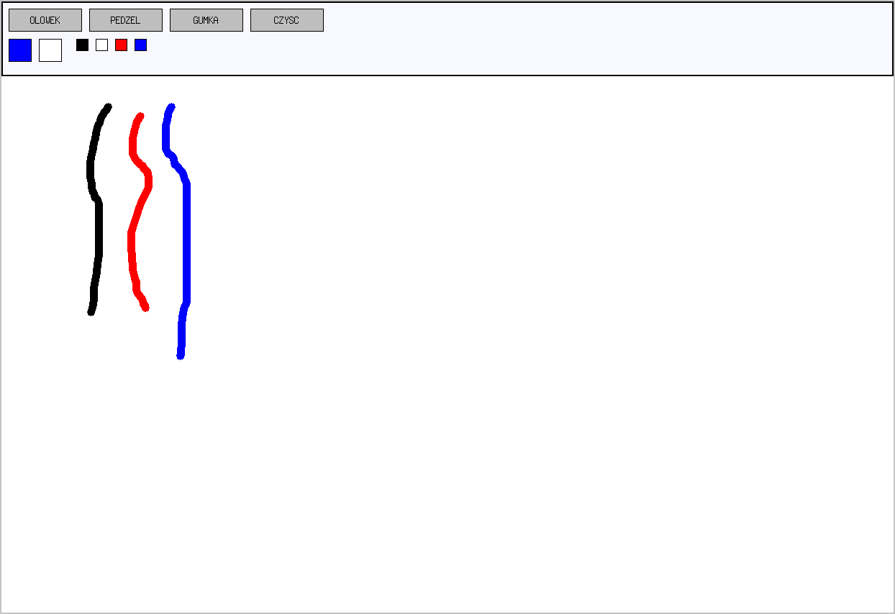
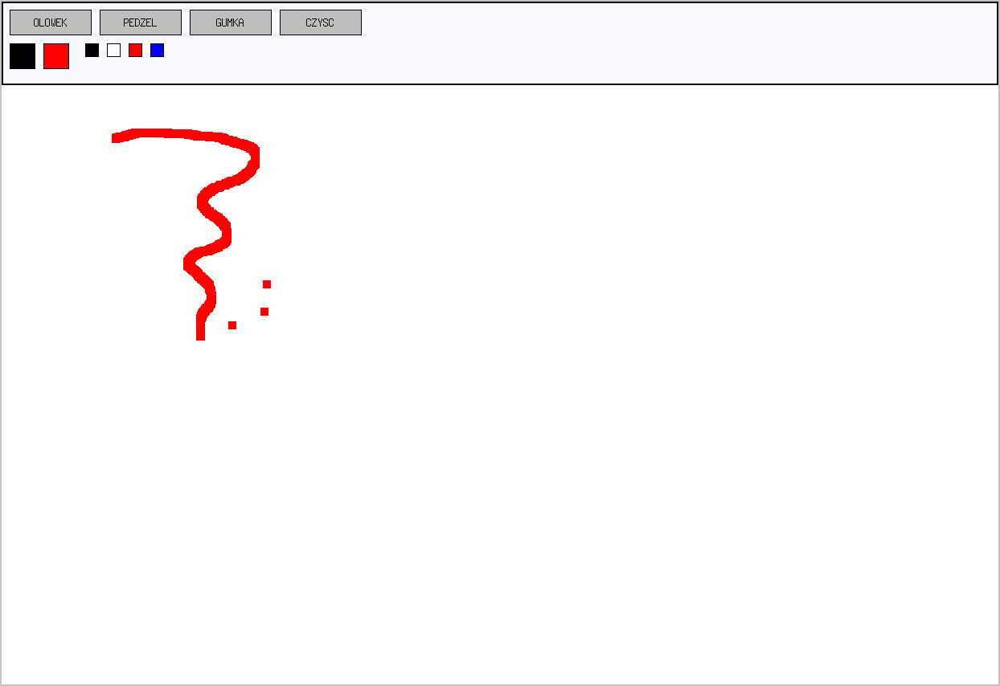
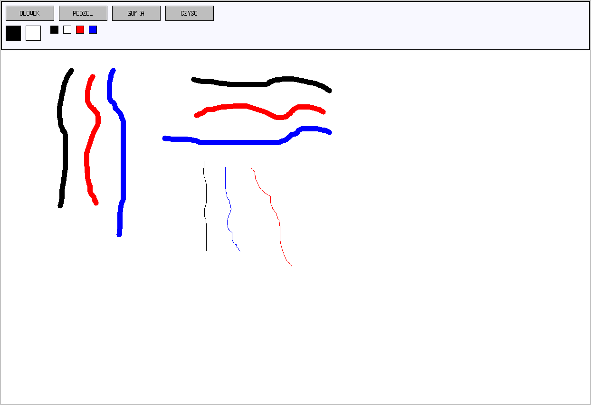

# Współbieżny Paint
Projekt przygotowany w ramach zaliczenia kursu 'Programowanie Współbieżne' na Uniwersytecie Gdańskim w 2020 roku.  
Program jest napisany w C przy wykorzystaniu biblioteki Xlib.  

## Getting Started
Aplikacja jest podzielona na programy Klienta i Serwera. 
1. Przed rozpoczęciem pracy oba programy należy skompilować  
Kompilacja programu Serwera: 'gcc ./serwer.c -lpthread -lX11 -o serwer'  
Kompilacja programu Klienta: 'gcc ./klient.c -lpthread -lX11 -o klient'  
2. Jako pierwszy należy uruchomić program Serwera.  
np. './serwer'
3. Następnie należy uruchomić program Klienta podając adres IP.  
np. './klient 10.0.2.15'  
W momencie uruchamiania programu Klienta, program Serwera powinien być już uruchomiony.  
4. Po uruchomieniu programu Klienta można rysować po tablicy  

## About application
Po uruchomieniu programu Klienta widoczna będzie czysta (biała) tablica oraz górny pasek służący do wyboru narzędzi i kolorów.  

### Wybór koloru (COLOR PICKER)
Dwa większe kwadraty reprezentują wybrane kolory.  
Po lewej, pierwotnie czarny, znajduje się kolor PODSTAWOWY.  
Po prawej, pierwotnie biały, znajduje się kolor DRUGORZĘDNY.  
Mniejsze kwadraty reprezentują możliwe kolory do wyboru.
Aby wybrać kolor, najpierw należy wybrać, który z kolorów chcemy wybrać (podstawowy czy drugorzędny) -
zostanie on zaznaczony do momentu wybrania koloru. Następnie należy kliknąć w jeden z mniejszych kwadratów reprezentujący kolor, który chcemy wybrać.
Przykład zmiany PODSTAWOWEGO koloru z czarnego na czerwony.

### Ołówek (PENCIL)
Rysowanie cienkich linii, wzorów PODSTAWOWYM kolorem. Ołówek jest domyślnie wybrany.  

### Pędzel (BRUSH)
Rysowanie pogrubionym ołówkiem PODSTAWOWYM kolorem.  

### Gumka (ERASER/COLOR ERASER)
Rysowanie kwadratowym pisakiem w kolorze DRUGORZĘDNYM.  

### Czyść (CLEAR)
Wyczyszczenie obszaru rysowania (cała tablica zostanie zakolorowana na biało).  
Przykład wyczyszczenia tablicy  
Przed wyczyszczeniem tablicy  

Po wyczyszczeniu tablicy  

## Build With:  
- C 
- X11/Xlib  

## Autor
- Jakub Skrzypiec (@jakub.skrzypiec - jakub.skrzypiec1@gmail.com)

